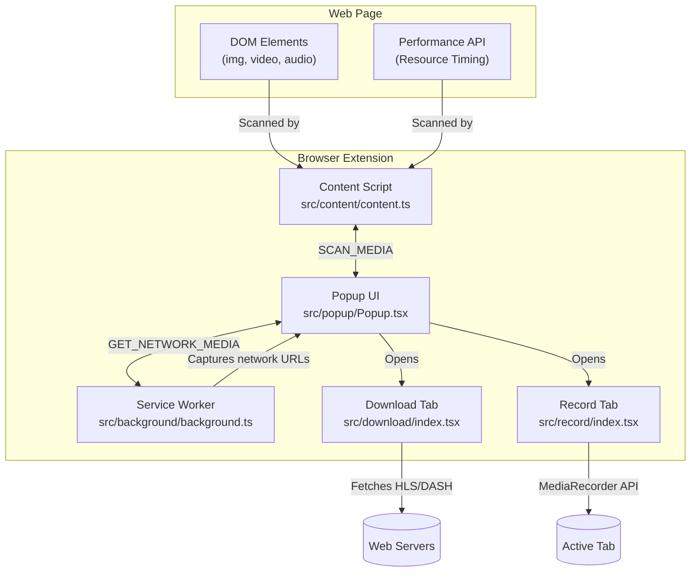

# Media Downloader Pro Extension

A powerful browser extension built with Manifest V3, React, TypeScript, and Vite. It detects, previews, and downloads all types of media files — including **streaming videos (HLS/DASH)** — from any webpage.

## ✨ Features

| Feature | Description |
|---------|-------------|
| 🖼️ **Image Detection** | Scans ``, `<picture>`, `srcset`, CSS `background-image` |
| 🎬 **Video Detection** | Scans `<video>`, `<source>`, `<embed>`, `<iframe>`, `<a>` links |
| 🎵 **Audio Detection** | Scans `<audio>`, `<source>`, `<a>` links |
| 📄 **Document Detection** | Detects PDF, DOCX, XLSX, ZIP, and other file links |
| 🌐 **Network Interception** | Captures ALL media URLs flowing through the browser via `chrome.webRequest` |
| 📊 **Performance API** | Detects resources already loaded by the browser |
| 📡 **HLS Streaming** | Parses `.m3u8` playlists, handles `#EXT-X-MAP`, downloads all `.ts` segments |
| 📡 **DASH Streaming** | Parses `.mpd` manifests, handles `<SegmentTemplate>` and `<SegmentTimeline>` |
| 🔴 **On-Page MDP Button** | Floating download button appears on videos when hovered |
| 🎥 **Screen Recording** | Built-in tab recorder to bypass DRM (Widevine/FairPlay) protections |
| 🎨 **Apple/iOS Design** | Premium popup UI with blur, rounded corners, and smooth animations |

## 🏗️ Architecture

The extension is structured following a clear separation of concerns, typical of modern Manifest V3 standards:



For more detailed technical documentation on the source code structure, please read the [src/README.md](./src/README.md).

## 🔒 Permissions

| Permission | Purpose |
|-----------|---------|
| `activeTab` | Access the current tab's content |
| `scripting` | Inject content script |
| `downloads` | Trigger file downloads |
| `webRequest` | Intercept network requests to detect media |
| `host_permissions: <all_urls>` | Required for network interception on all sites |

## 🚀 Setup & Installation

### 1. Requirements
- Node.js >= 18.x
- npm >= 9.x

### 2. Install dependencies
```bash
npm install
```

### 3. Build for production
```bash
npm run build
```
This will compile all React applications, content scripts, and background scripts into the `dist/` directory.

### 4. Load the extension in Chrome
1. Go to `chrome://extensions/`
2. Enable **Developer mode** (top right)
3. Click **Load unpacked** and select the generated `dist` folder.

### 5. Development (Watch Mode)
*Note: Due to a known issue with CRXJS, running the dev server might conflict with background script names. Prefer full builds for accurate testing of service workers.*
```bash
npm run dev
```

## ⚠️ Known Limitations & DRM Bypass

- **DRM-protected content** (Netflix, Disney+, Amazon Prime) cannot be downloaded natively because segments are encrypted (Widevine).
- **Solution / Fallback**: The extension includes a **Record Tab** (`record.html`) that allows users to use `navigator.mediaDevices.getDisplayMedia` to legally screen-record the active tab and save it as a `.webm` file.
- **YouTube** uses adaptive streaming with separate audio/video tracks. 

## 🛠️ Tech Stack

- **Runtime**: Chrome Extension Manifest V3
- **UI Framework**: React 19 + TypeScript
- **Styling**: Tailwind CSS v4
- **Build Tool**: Vite 8 + @crxjs/vite-plugin
- **Icons**: Lucide React
