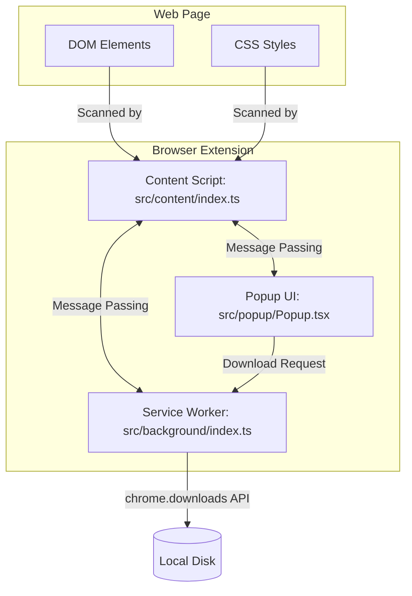

# Media Downloader Pro Extension

A powerful browser extension built with Manifest V3, React, TypeScript, and Vite. It allows users to effortlessly detect, preview, and download media files (images, videos, audio, and documents) from any webpage.

## 🏗️ Architecture

This extension follows the standard **Manifest V3** architecture.



### Components

1. **Popup UI (`src/popup`)**: The user interface built with React and TailwindCSS. It requests data from the content script and displays the detected media files.
2. **Content Script (`src/content`)**: Injected into the active web page. It traverses the DOM to find media elements (``, `<video>`, `<audio>`) and sends them back to the Popup.
3. **Service Worker (`src/background`)**: Runs in the background. It handles heavy operations like batch downloads and orchestrating the download queue via the `chrome.downloads` API.

## 🚀 Setup & Installation

1. Install dependencies:
   ```bash
   npm install
   ```
2. Run development build (watch mode):
   ```bash
   npm run dev
   ```
3. Load the extension in your browser:
   - Go to `chrome://extensions/`
   - Enable "Developer mode"
   - Click "Load unpacked" and select the `dist` folder generated in the project root.
