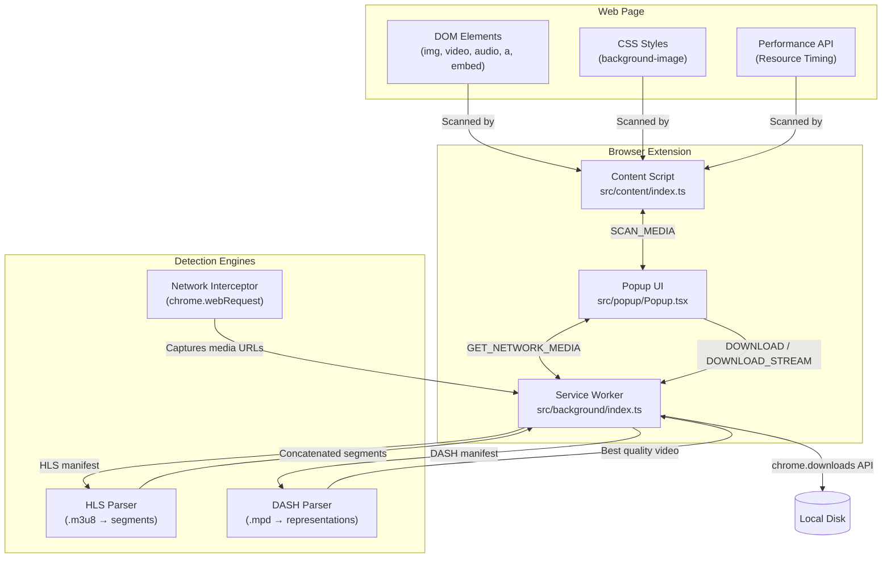

# Media Downloader Pro Extension

A powerful browser extension built with Manifest V3, React, TypeScript, and Vite. It detects, previews, and downloads all types of media files — including **streaming videos (HLS/DASH)** — from any webpage.

## ✨ Features

| Feature | Description |
|---------|-------------|
| 🖼️ **Image Detection** | Scans ``, `<picture>`, `srcset`, CSS `background-image` |
| 🎬 **Video Detection** | Scans `<video>`, `<source>`, `<embed>`, `<iframe>`, `<a>` links |
| 🎵 **Audio Detection** | Scans `<audio>`, `<source>`, `<a>` links |
| 📄 **Document Detection** | Detects PDF, DOCX, XLSX, ZIP, and other file links |
| 🌐 **Network Interception** | Captures ALL media URLs flowing through the browser via `chrome.webRequest` |
| 📊 **Performance API** | Detects resources already loaded by the browser |
| 📡 **HLS Streaming** | Parses `.m3u8` playlists, downloads all `.ts` segments, concatenates into a single file |
| 📡 **DASH Streaming** | Parses `.mpd` manifests, downloads the best quality video representation |
| 🔴 **On-Page MDP Button** | Floating download button appears on videos when hovered |
| 🎨 **Apple/iOS Design** | Premium popup UI with blur, rounded corners, and smooth animations |

## 🏗️ Architecture



## 🧩 Components

### Content Script (`src/content/index.ts`)
Injected into every web page. Responsibilities:
- **DOM Scanner**: Traverses ``, `<video>`, `<audio>`, `<a>`, `<embed>`, `<object>`, `<iframe>` elements and `data-src` attributes
- **CSS Scanner**: Extracts `background-image` URLs from computed styles
- **Performance API Scanner**: Uses `performance.getEntriesByType('resource')` to find loaded media
- **MDP Button**: Renders a floating red download button (Shadow DOM isolated) on `<video>` elements when hovered

### Service Worker (`src/background/index.ts`)
Runs in the background. Responsibilities:
- **Network Interceptor**: Listens to `chrome.webRequest.onCompleted` to capture all media URLs by Content-Type and file extension
- **Stream Tracker**: Separately stores HLS (`.m3u8`) and DASH (`.mpd`) manifest URLs per tab
- **HLS Downloader**: Parses master/media playlists, downloads all `.ts` segments with 4x concurrency, concatenates into a single video file
- **DASH Downloader**: Parses MPD XML, selects highest bandwidth representation, downloads the video
- **Download Manager**: Handles `DOWNLOAD`, `DOWNLOAD_STREAM`, `DOWNLOAD_BEST_VIDEO`, and `DOWNLOAD_VIA_TAB` actions

### Popup UI (`src/popup/Popup.tsx`)
React-based popup interface. Responsibilities:
- Displays all detected media (DOM + Network + Streams) with filters (All, Images, Videos, Audios, Docs)
- Image preview lightbox with quality selection
- Batch selection and download
- Stream download with progress indication

## 🔒 Permissions

| Permission | Purpose |
|-----------|---------|
| `activeTab` | Access the current tab's content |
| `scripting` | Inject content script |
| `downloads` | Trigger file downloads |
| `webRequest` | Intercept network requests to detect media |
| `host_permissions: <all_urls>` | Required for network interception on all sites |

## 📡 Download Pipeline

```
User clicks download
        │
        ▼
┌─ Is it a STREAM:: URL? ──────────────────────┐
│  YES → DOWNLOAD_STREAM                        │
│  ├─ Fetch manifest (.m3u8 / .mpd)             │
│  ├─ Parse playlist / XML                      │
│  ├─ Download all segments (4 concurrent)      │
│  ├─ Concatenate into single Blob              │
│  └─ Save via chrome.downloads                 │
│                                               │
│  NO → Is it a BLOB_VIDEO? ───────────────────│
│  YES → DOWNLOAD_BEST_VIDEO                    │
│  ├─ Check direct MP4s captured on network     │
│  ├─ If none: check HLS/DASH streams           │
│  └─ Download best match                       │
│                                               │
│  NO → Direct HTTP URL ───────────────────────│
│  → chrome.downloads.download(url)             │
│  → Fallback: DOWNLOAD_VIA_TAB (open in tab)   │
│  → Fallback: <a download> click               │
└───────────────────────────────────────────────┘
```

## 🚀 Setup & Installation

1. Install dependencies:
   ```bash
   npm install
   ```
2. Build for production:
   ```bash
   npm run build
   ```
3. Load the extension in Chrome:
   - Go to `chrome://extensions/`
   - Enable **Developer mode**
   - Click **Load unpacked** and select the `dist` folder
4. For development (watch mode):
   ```bash
   npm run dev
   ```

## ⚠️ Known Limitations

- **DRM-protected content** (Netflix, Disney+, Amazon Prime) cannot be downloaded — segments are encrypted with Widevine
- **YouTube** uses adaptive streaming with separate audio/video tracks; the extension captures video segments but muxing requires FFmpeg
- **Very large videos** (>500 MB) may cause memory pressure during segment concatenation in the service worker

## 🛠️ Tech Stack

- **Runtime**: Chrome Extension Manifest V3
- **UI Framework**: React 19 + TypeScript
- **Styling**: Tailwind CSS v4
- **Build Tool**: Vite 8 + @crxjs/vite-plugin
- **Icons**: Lucide React
